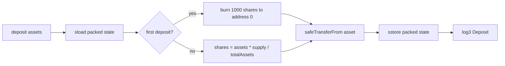

# YulSafe

**An EVM-optimized ERC4626 vault in Solidity and Yul, built on Solady, tested on the EVM and on zkSync Era.**

YulSafe packs the vault's two hot values into one storage slot, does its share math in inline assembly, and emits events with raw LOG opcodes. On the EVM it reads state in a single SLOAD and cuts view-function gas by up to 67% against Solady's own ERC4626, while keeping donation resistance, first-depositor protection, reentrancy guards and vault-favoring rounding. On EraVM the picture is different, and the numbers below say so.

[](https://github.com/yodablocks/yulsafe/actions/workflows/test.yml)


---

## Why YulSafe

A standard ERC4626 vault reads `totalAssets` and `totalSupply` from two storage slots on every conversion, and every deposit or withdraw touches both again. On a rollup where L1 data and storage dominate the fee, those extra slot reads and writes are the cost.

YulSafe makes three changes and keeps everything else standard:

- **One slot, two values.** `totalAssets` and `totalSupply` live in the same 256-bit word as two 96-bit fields. Every read is one SLOAD, every update is one SSTORE.
- **Assembly on the hot path.** Share conversions, packing and unpacking, and event emission are written in Yul. Measured against a plain Solidity twin with the same layout, the assembly buys nothing at runtime; see [Did the assembly matter?](#did-the-assembly-matter) below. The layout is the optimization.
- **Security is not the trade-off.** The vault never reads its own token balance, so sending tokens to it directly cannot move the share price and the classic ERC4626 donation attack is inert. Minimum liquidity is burned on the first deposit, all rounding favors the vault, and every state-changing function is reentrancy guarded and pausable.

It is a technical showcase and a usable savings-vault primitive. It is **unaudited**. Read the [security policy](SECURITY.md) before touching real funds.

## Features

| | |
|---|---|
| **ERC4626 interface** | `deposit`, `mint`, `withdraw`, `redeem`, the four `preview*` and four `max*` views, `convertToShares`, `convertToAssets` and `totalAssets`. Shares are a Solady ERC20. |
| **Packed vault state** | `totalAssets` (96 bits) and `totalSupply` (96 bits) share one slot, with 64 bits reserved. Capacity is about 79 billion tokens at 18 decimals. Overflow reverts with `ExceedsMaxCapacity`. |
| **Yul hot path** | Conversions use `mul` and `div` directly on the unpacked values. `Deposit` is emitted with `log3` and `Withdraw` with `log4`. Reverts use custom errors raised from assembly. |
| **Donation resistance** | Share price comes from the packed `totalAssets`, which only changes inside `deposit`, `mint`, `withdraw` and `redeem`. Tokens transferred straight to the contract are ignored by pricing, so a donation cannot inflate or deflate shares. Invariant-tested. |
| **First-depositor protection** | The first deposit mints `MINIMUM_LIQUIDITY` (1000) shares to `address(0)`, permanently locking them, which closes the rounding edge case on a tiny first deposit. |
| **Vault-favoring rounding** | `deposit` and `redeem` round down what the user receives. `mint` and `withdraw` round up what the user pays. Fuzz tests enforce this on every path. |
| **Guards** | Solady `ReentrancyGuard` on all state changes, owner-only `pause` and `unpause`, zero-amount and zero-address checks. |
| **Solady base** | ERC20, Ownable, ReentrancyGuard and SafeTransferLib from Solady, vendored in `lib/` at main commit `2afba69`. The a16z ERC4626 property suite is vendored too, test-only, under its own AGPL-3.0 license. |

## Quick start

Requires [Foundry](https://book.getfoundry.sh/getting-started/installation). Dependencies are vendored, so there is nothing to install.

```sh
git clone https://github.com/yodablocks/yulsafe && cd yulsafe
forge build
forge test
forge test --gas-report        # YulSafe next to Solady's ERC4626 on the same calls
```

For zkSync Era, install [foundry-zksync](https://github.com/matter-labs/foundry-zksync) and use the `zksync` profile, which compiles through zksolc and runs the tests on the EraVM emulator:

```sh
FOUNDRY_PROFILE=zksync forge build
FOUNDRY_PROFILE=zksync forge test
```

## Example

```solidity
import {YulSafeERC20} from "src/YulSafeERC20.sol";

YulSafeERC20 vault = new YulSafeERC20(address(usdc), "YulSafe USDC", "ysUSDC");

usdc.approve(address(vault), 1_000e6);
uint256 shares = vault.deposit(1_000e6, msg.sender);   // rounds shares down

uint256 assets = vault.redeem(shares, msg.sender, msg.sender);
```

The first depositor into an empty vault receives `assets - 1000` shares; the missing 1000 are minted to `address(0)` and never leave. Every later deposit is priced against the packed `totalAssets` and `totalSupply`.

To deploy, copy `.env.example` to `.env`, set `PRIVATE_KEY` and `ASSET_TOKEN`, and run `script/Deploy.s.sol` with `forge script`.

## How it works

The vault state is one word:

```
bit 255                  159                   95                    0
    ┌──────────────────────┬─────────────────────┬─────────────────────┐
    │   reserved (64 bits) │ totalSupply (96)    │ totalAssets (96)    │
    └──────────────────────┴─────────────────────┴─────────────────────┘
```

A conversion is a single load and two masks:

```solidity
assembly {
    let packed := sload(_packedVaultState.slot)
    let assets_ := and(packed, MASK_96)
    let supply_ := and(shr(96, packed), MASK_96)
    shares := div(mul(assets, supply_), assets_)
}
```

A deposit follows the same shape end to end:



- **Reads** never touch more than the one packed slot plus the caller's balance.
- **Writes** update both totals with one SSTORE after the token transfer has succeeded.
- **Rounding** is decided per function, not per helper, so the direction is explicit at each call site and checked by the rounding fuzz suite.

## Gas

### EVM

Measured with `forge test --gas-report` on the standard EVM, solc 0.8.37 targeting cancun, optimizer on at 10,000,000 runs, against Solady's `ERC4626` under the same calls.

| Function | YulSafe | Solady ERC4626 | Change |
|---|---|---|---|
| `totalAssets()` | 2,321 | 5,621 | -59% |
| `convertToShares()` | 2,674 | 8,072 | -67% |
| `convertToAssets()` | 2,675 | 8,108 | -67% |
| `deposit()` first | 63,028 | 54,709 | +15% |
| `deposit()` subsequent | 175,513 | 106,009 | +66% |
| `mint()` | 63,078 | 54,735 | +15% |
| `withdraw()` | 61,279 | 54,576 | +12% |
| `redeem()` | 61,303 | 53,284 | +15% |

Deployment: 1,712,163 gas, 8,391 bytes.

The view functions are where the packed slot pays off. State-changing calls cost more than Solady's base vault because they carry a reentrancy guard, a pause check, the minimum-liquidity burn and configurable name and symbol storage, none of which the Solady baseline has.

### zkSync Era (EraVM)

Measured from transaction receipts on a local `anvil-zksync` 0.6.11 node, compiled with zksolc 1.5.15 and the zkSync-patched solc 0.8.30, same call sequence for both vaults. Reproduce with `script/bench-eravm.sh`. Views cannot be sent as transactions, so they are reported through `eth_estimateGas`, which on zkSync includes a large fixed per-transaction overhead.

| Function | YulSafe | Solady ERC4626 | Change |
|---|---|---|---|
| `deposit()` first | 201,031 | 173,466 | +16% |
| `deposit()` subsequent | 178,774 | 166,106 | +8% |
| `mint()` | 178,768 | 166,148 | +8% |
| `withdraw()` | 176,294 | 167,356 | +5% |
| `redeem()` | 176,288 | 164,200 | +7% |
| `totalAssets()` estimate | 150,407 | 159,929 | -6% |
| `convertToShares()` estimate | 150,407 | 163,102 | -8% |
| `convertToAssets()` estimate | 150,407 | 163,102 | -8% |

**Read this honestly.** The 67% view saving on the EVM does not carry over. EraVM charges every transaction a large fixed cost for the bootloader and for publishing state to L1, and a storage read is cheap relative to that. Saving one SLOAD moves the total by single-digit percentages, and the extra security checks on the write path cost about as much as they do on the EVM. YulSafe runs correctly on zkSync Era under the same test suite, but on today's EraVM its gas edge is small. The packed-slot technique is an EVM optimization first, which is why the project now describes itself that way.

## Did the assembly matter?

`test/mocks/PlainPackedVault.sol` is YulSafe rewritten in plain Solidity with zero assembly: two `uint96` fields the compiler packs into one slot on its own, the same checks, rounding, first-deposit burn, events and errors. It passes the same 26 a16z ERC4626 properties. Same benchmark, same calls, solc 0.8.37, optimizer at 10,000,000 runs:

| Function | YulSafe (Yul) | Plain Solidity | Solady ERC4626 |
|---|---|---|---|
| `totalAssets()` | 2,321 | 2,321 | 5,621 |
| `convertToShares()` | 2,674 | 2,679 | 8,072 |
| `convertToAssets()` | 2,675 | 2,680 | 8,108 |
| `deposit()` first | 63,028 | 61,551 | 54,709 |
| `deposit()` subsequent | 175,513 | 173,805 | 106,009 |
| `mint()` | 63,078 | 61,740 | 54,735 |
| `withdraw()` | 61,279 | 59,938 | 54,576 |
| `redeem()` | 61,303 | 59,818 | 53,284 |
| Deployment gas | 1,712,163 | 2,154,694 | 1,185,598 |

On EraVM, from transaction receipts with the same script as above, the twin is about 1% cheaper than YulSafe on every write and identical on every view.

**The honest reading.** The views are equal to within five gas: the compiler emits one SLOAD for two adjacent `uint96` fields without any help. The plain version is 1,300 to 1,500 gas cheaper on every write. The only thing the hand-written Yul buys is a smaller deployment, and under via-IR even that gap shrinks to 2%. Everything YulSafe saves against Solady comes from putting both totals in one slot, which is a layout decision any Solidity programmer can make in two lines. The assembly is a showcase of technique, not a source of savings. The vault keeps it because that is what the project is for, and this section exists so nobody copies the assembly expecting a gas win.

## Tests

200 tests across nine suites, run in CI on every push and pull request. The same suite, minus the invariant harness, also runs in CI on the EraVM emulator through zksolc.

| Suite | Tests | Covers |
|---|---|---|
| `YulSafe.t.sol` | 62 | ERC4626 conformance, edge cases, access control |
| `GasBenchmark.t.sol` | 24 | Side-by-side gas against Solady's ERC4626 and the plain Solidity twin |
| `YulSafeHardening.t.sol` | 10 | Input bounds, preview and actual agreement, max functions never revert, consistent views inside token hooks |
| `ERC4626Std.t.sol`, `PlainPackedVaultStd.t.sol` | 26 + 26 | [a16z's ERC4626 property suite](https://github.com/a16z/erc4626-tests): round trips never profit, previews never over- or under-estimate, conversions are caller-independent, max functions never revert. Zero tolerance |
| `invariants/` | 19 | Solvency, share price never decreases, donations never move the price, locked minimum liquidity, no value extraction. EVM only: the handler drives cheatcodes from a non-test contract, which the EraVM emulator does not support |
| `fuzz/RoundingProperties.t.sol` | 19 | Every path rounds in the vault's favor |
| `fuzz/InflationAttack.t.sol` | 14 | Victims never receive zero shares, attackers lose the locked liquidity |

```sh
FOUNDRY_INVARIANT_RUNS=1000 forge test --match-contract YulSafeInvariants
forge test --match-path "test/fuzz/*" --fuzz-runs 1000
```

## Write-up

[The compiler was fine. My vault was not.](docs/the-compiler-was-fine.md) tells the story of the September 2026 refresh: a placeholder README, a wrong error selector, a gas claim measured on the wrong chain, and a byte-identical result on a compiler written from scratch in Zig.

## Compiler conformance

YulSafe doubles as a real-world test input for [oksolc](https://github.com/okcontract/oksolc), a from-scratch Solidity compiler in Zig that targets byte-compatibility with solc 0.8.36 on the optimized via-IR path. The `viair` profile builds this project the way oksolc supports, and `script/compare-oksolc.py` diffs the artifacts of two compilers byte for byte:

```sh
FOUNDRY_PROFILE=viair forge build --force
FOUNDRY_PROFILE=viair forge build --force --use /path/to/oksolc --out out-oksolc
script/compare-oksolc.py out-viair out-oksolc
```

As of September 2026, oksolc built from `main` produces creation bytecode, runtime bytecode, ABI and metadata identical to upstream solc 0.8.36 for all 45 artifacts in this project, including Solady, forge-std and the test contracts, and emits the same 60 diagnostics.

## Deployed contracts

zkSync Sepolia, deployed 2026-09-26 from the v0.2.0 contract code, compiled with zksolc 1.5.15 and the zkSync-patched solc 0.8.30 through the `zksync` profile. Both are verified on the explorer. The vault is owned by `0xEAAEB8ddcf1772ca76c701C68C37b63DC89861cf`.

| Contract | Address |
|---|---|
| YulSafe vault | [`0x7EC180309204B56d9425eb0509A1D8EBd5FD278f`](https://sepolia.explorer.zksync.io/address/0x7EC180309204B56d9425eb0509A1D8EBd5FD278f) |
| MockERC20 (mUSDC, 6 decimals) | [`0x8874f8524eFf97b272CdF1cB472dB8fb66e0B133`](https://sepolia.explorer.zksync.io/address/0x8874f8524eFf97b272CdF1cB472dB8fb66e0B133) |

Example transactions on that deployment, gas as reported in the receipts:

| Action | Transaction | Gas used |
|---|---|---|
| Approve vault | [`0x1958e337…9200d1`](https://sepolia.explorer.zksync.io/tx/0x1958e337ef8fd4c8c9b1ab1e5184436b5c7d01cdc0f8fc5696da6492f59200d1) | 92,462 |
| Deposit 500 mUSDC, first deposit | [`0x1d079799…a70e86`](https://sepolia.explorer.zksync.io/tx/0x1d079799960a1047bde56a1ff74d8b627ff26b1c1f21e23712a459397fa70e86) | 144,720 |
| Withdraw 100 mUSDC | [`0xc282414c…72b97f`](https://sepolia.explorer.zksync.io/tx/0xc282414c97c87512457a4b6bda029996de46eb2b01796cac5db3ebd35e72b97f) | 90,915 |

After those two calls the vault holds 400 mUSDC against 400,000,000 shares, of which 1,000 are locked at `address(0)`.

Verification goes through `script/verify-zksync.py`, because foundry-zksync's built-in verifier sends settings the explorer rejects. The previous deployment from January 2026 at `0xdbB4C8d522Ba83a43ADa63f8555B3b47b40cc5ee` predates the fixes in v0.2.0 and should not be used.

## Limitations

- Standard ERC20 assets only. Fee-on-transfer and rebasing tokens will break the packed accounting.
- Tokens sent directly to the vault are stranded. Internal accounting is what makes donations harmless, and the flip side is that there is no sweep function and no way to credit them to anyone. A yield strategy would need an explicit, owner-gated function to recognize gains.
- No yield strategy. The vault holds the asset and does nothing with it.
- 96-bit totals. A vault that needs more than about 79 billion tokens at 18 decimals cannot use this layout.
- Owner is a single address with pause power. Use a multisig.
- Do not send ETH to the vault. Solady's ownership functions are payable and there is no way to move ETH back out.
- The default profile targets the cancun EVM version and emits PUSH0. Chains without Shanghai support need an older `evm_version`.
- **Unaudited.** See [SECURITY.md](SECURITY.md) for the threat model and how to report an issue.

## License

[MIT](LICENSE)
